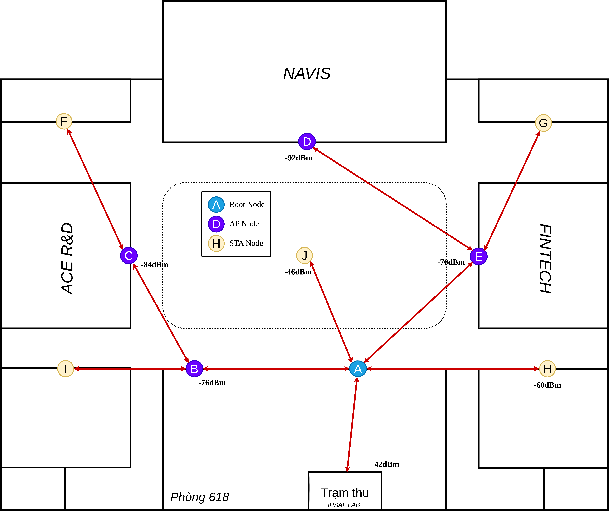

# Mesh nodes
PainlessMesh creates a self organizing and repairing network where all nodes are connected. All nodes in the mesh are equal. The network uses a star topology, avoiding any circular paths. Messages between different nodes are sent in JSON format, making them easy to understand and produce.  

## Network structure

We perform this project on the sixth floor of the Ta Quang Buu Library, Hanoi University of Science and Technology, which is 2800 square meters. We chose to set up a network of 10 nodes, comprising 5 AP_STA nodes (which serve as both an AP and a STA to connect to other APs) and 5 STA nodes (wake up and choose an appropriate AP to connect and broadcast message, then go to sleep). 

 

  

